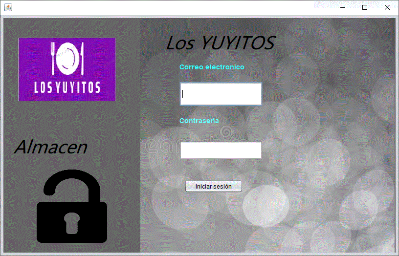
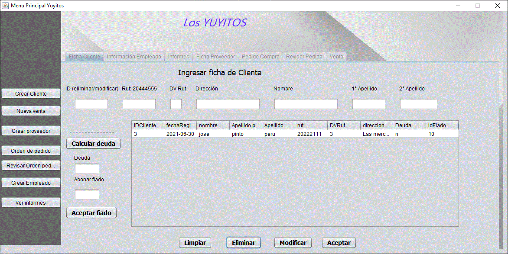
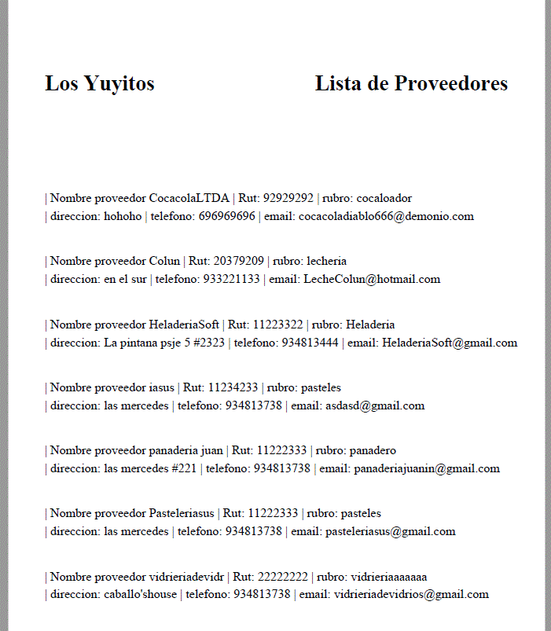
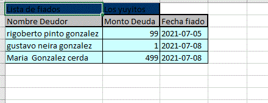
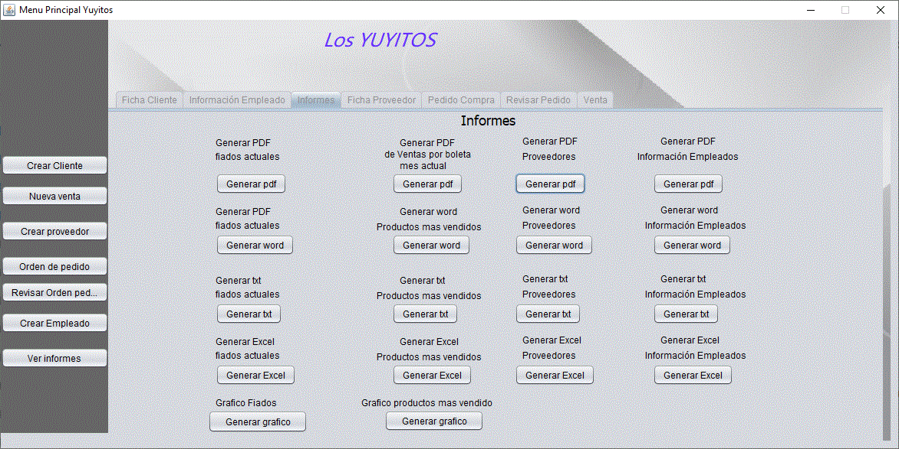
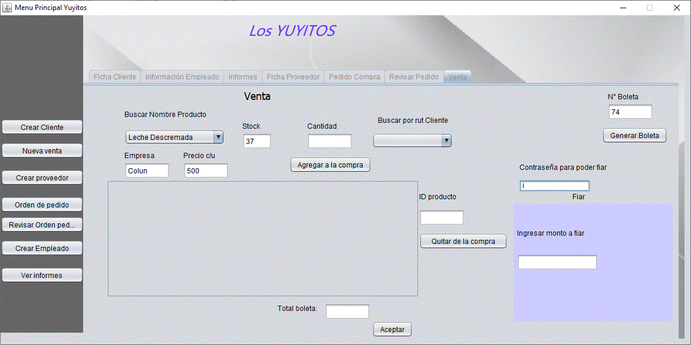
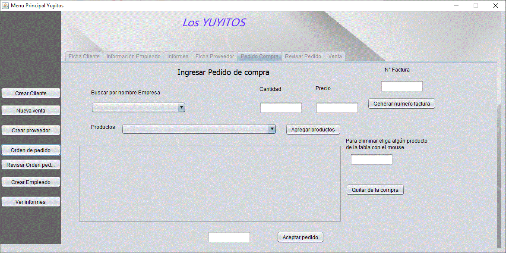
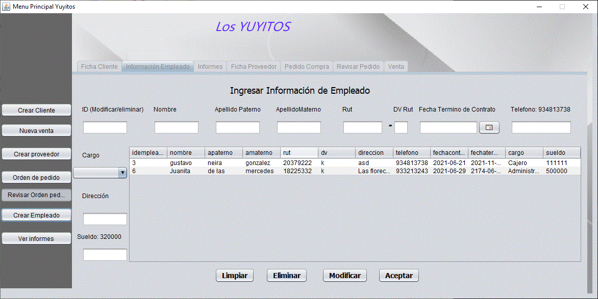
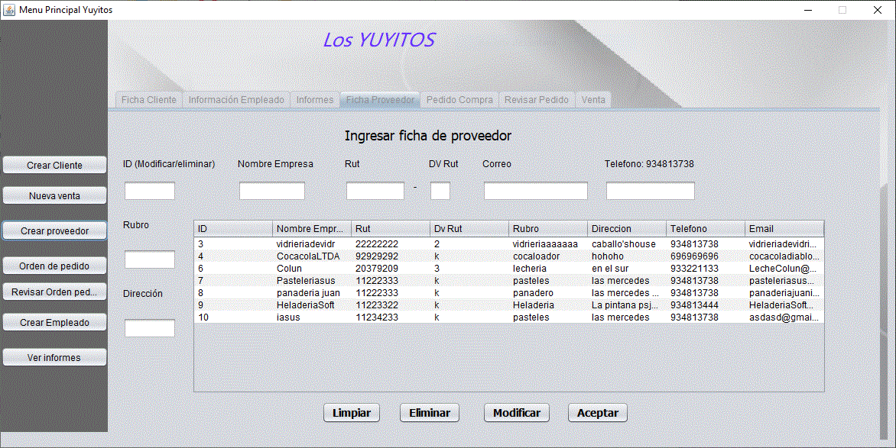
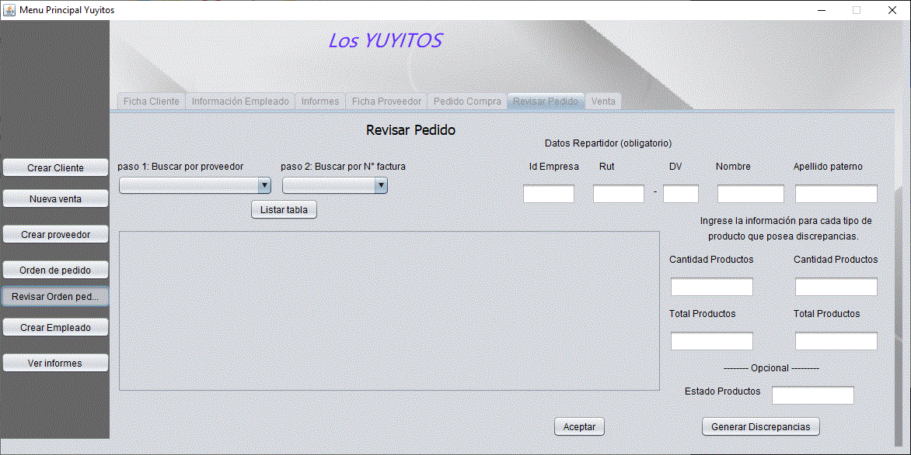

# PORTAFOLIO-YUYITOS
## Portafolio de título Duoc UC, Caso N°5.

## ¿Qué es esto?
Sistema de gestión del almacén Los Yuyitos.

## ¿Qué necesito?
Debe existir una ID de empleado, que debe ser 1.

## Capturas de pantalla

## Agradecimientos
- A mi compa el Rubius.
- A mi gato querido.
- A Julio profe que me llevó hasta acá.
